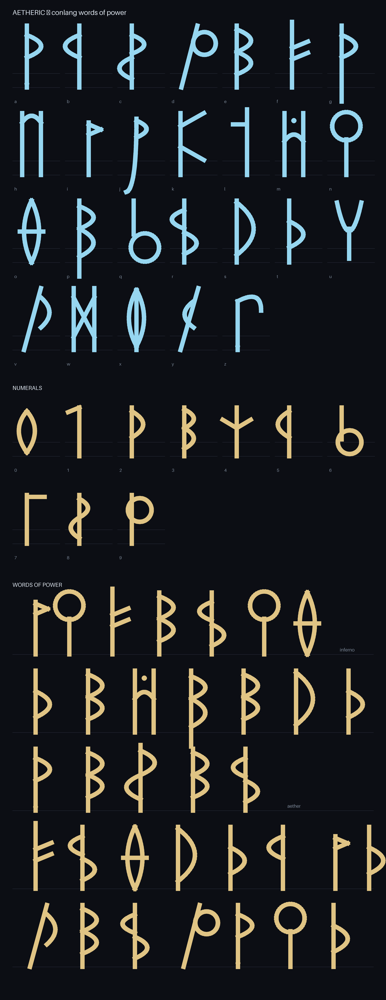

# Aetheric — the conlang "words of power"

`Aetheric` is the in-game constructed-script display font used to render
proficiency **words of power**. It is **decorative flavour, never readable
copy** — the glyphs are deliberately abstract and non-Latin, so anything a
player must actually read stays in the normal UI font.

- **Font asset:** [`UI/static/fonts/Aetheric.woff2`](../../static/fonts/Aetheric.woff2) (~5 KB), served at `/fonts/Aetheric.woff2`.
- **In the app:** `@font-face` in `src/styles/common.scss`, exposed as the
  `--conlang` CSS token, and consumed through the
  [`WordOfPower`](../../src/components/WordOfPower.svelte) component (which keeps
  the romanization as the DOM text for accessibility).
- **Specimen:** [`specimen.png`](./specimen.png) — alphabet, numerals,
  ligatures, and sample words of power.



## Regenerating

The font is **generated, not hand-drawn** — every glyph is a parametric set of
strokes in `generate_font.py`, so the script is the source of truth. Edit the
glyph definitions there and rebuild **both** outputs (the committed
`specimen.png` is generated documentation and drifts if only the font is
rebuilt):

```sh
pip install -r requirements.txt                 # pinned fonttools / brotli / pillow
python3 UI/scripts/conlang/generate_font.py     # -> UI/static/fonts/Aetheric.woff2
python3 UI/scripts/conlang/render_specimen.py   # -> UI/scripts/conlang/specimen.png
```

## Design rules

The forms are intentionally constrained so edits stay coherent:

- **Abstract, not Latin.** No glyph should read as the Latin letter typed to
  produce it; words must not look like English. (`A`–`Z` map to the same glyph
  as `a`–`z`.)
- **Grounded.** Every glyph sits on the baseline; descenders are a deliberate
  few (`g j p y`) at a modest depth — nothing floats.
- **Varied bases.** Single stem + bows (the "thorn" family), twin-stem bridges,
  stem + twigs, leaning stems, and baseline bowls — so words gain rhythm instead
  of a picket fence of identical stems.
- **Numerals are a shorter register** so numbers stay distinct from letters.
- Six digraph ligatures (`th sh ch ng ph kh`) fuse into single forms via the
  `liga` feature.

## Caveats

Curves are approximated by chains of overlapping straight quads (smooth at UI
sizes; faint faceting only appears at very large display sizes). Outlines
self-overlap and rely on the non-zero winding rule — fine for browsers; if a
stricter consumer ever needs clean outlines, run `removeOverlaps` over the glyf
table.
