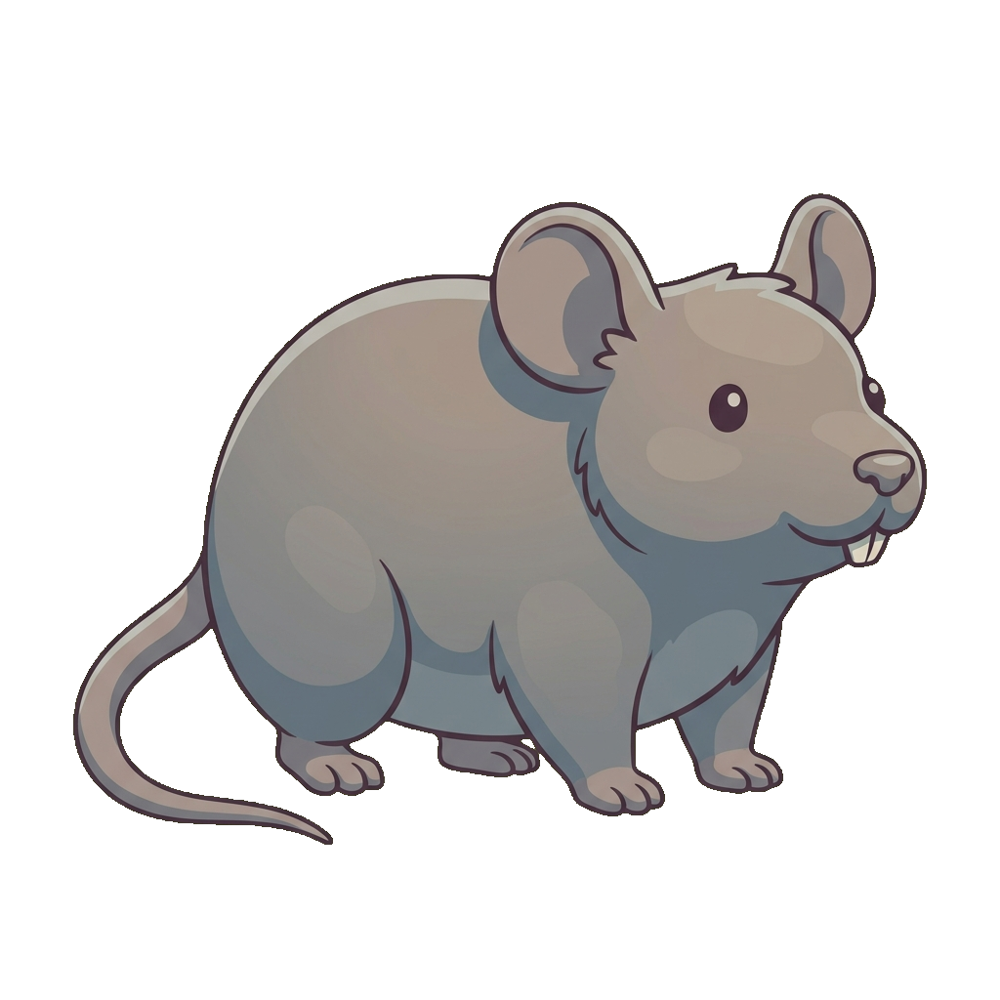
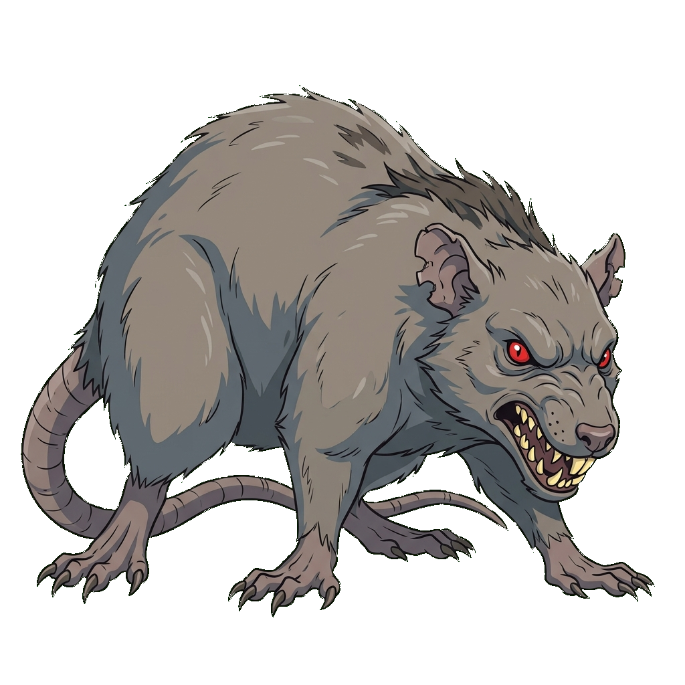
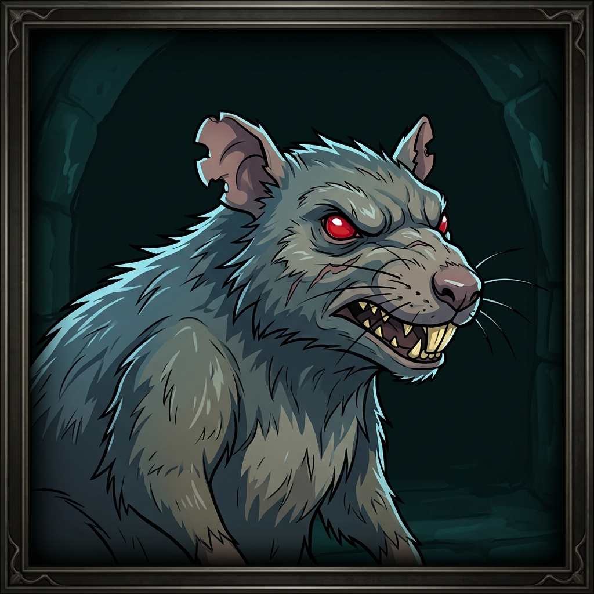
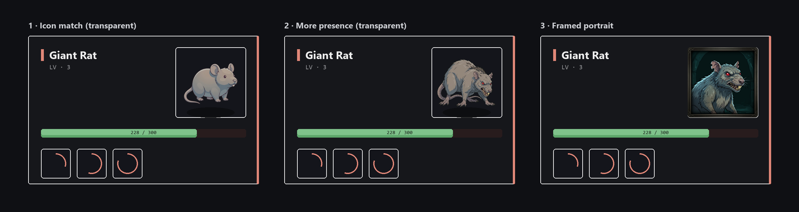
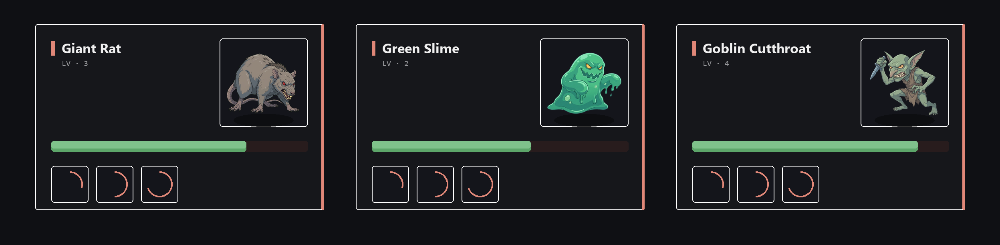
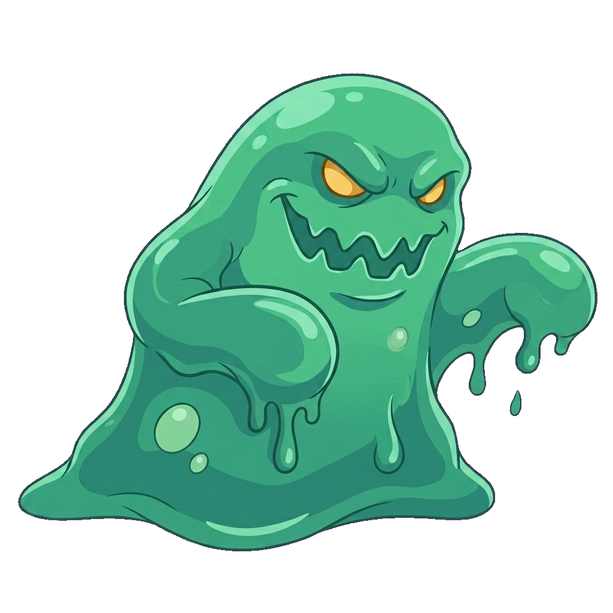
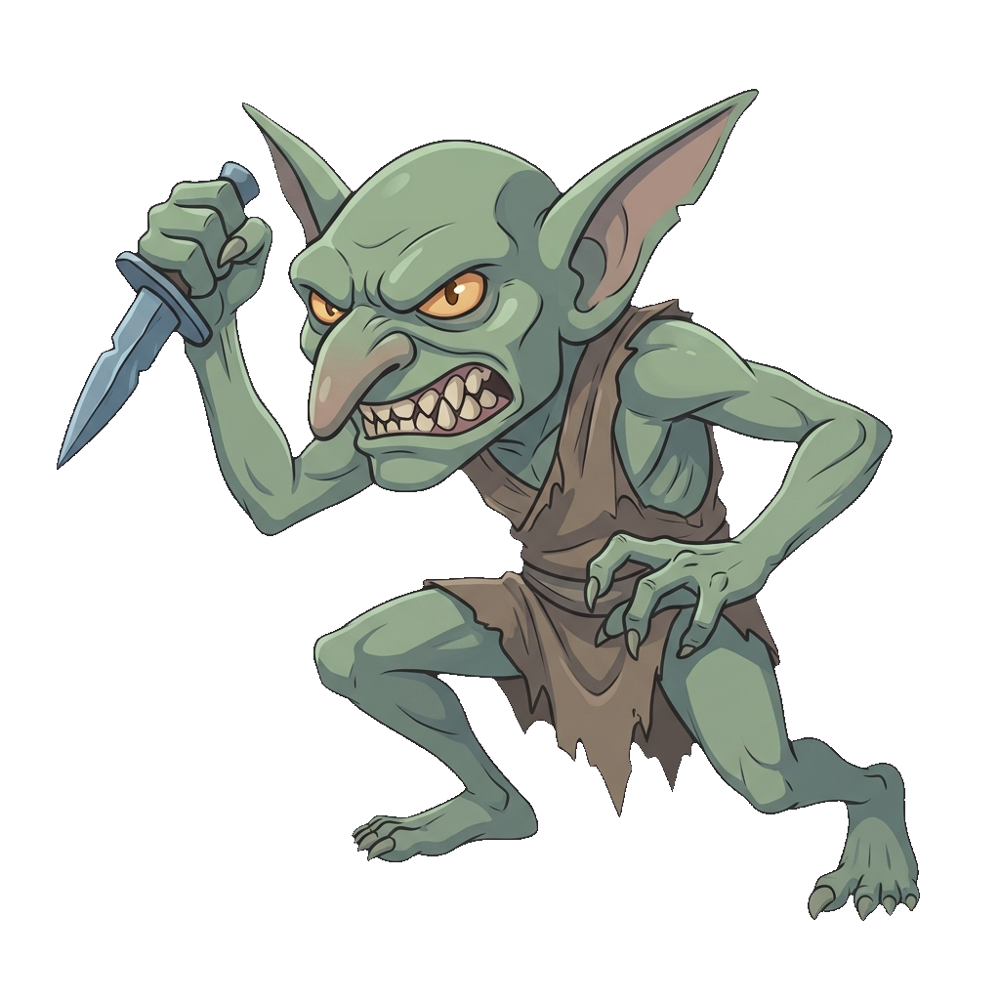

# Spike — Enemy art direction

- **Spike issue:** _not yet created_ — this was an informal art-direction workshop. Issues
  below are **proposed, not created** (deferred: "we'll probably implement this in the future").
- **Status:** Direction explored and validated on concept art. Not implemented; no schema,
  contract, or UI changes were made. Stand-in creatures only — the real roster lives in the DB.
- **Date:** 2026-06-19.

## Goal

Decide whether the game should have per-enemy art, what visual treatment fits, and whether
the existing item/skill icon pipeline + locked house style can produce it. Produce concept
art and an in-context mockup good enough to lock the direction before committing engineering
work.

## Current state

- **No enemy art exists, and nothing to hang it on.** `Enemy`
  ([Game.Infrastructure/Entities/Enemy.cs](../../../Game.Infrastructure/Entities/Enemy.cs),
  [Game.Core/Enemies/Enemy.cs](../../../Game.Core/Enemies/Enemy.cs)) has `Id`, `Name`,
  `IsBoss`, `RetiredAt` and relations — **no `IconPath`**, unlike `Item` and `Skill` which
  both carry one.
- **The fight card has no portrait slot.**
  [BattlerCard.svelte](../../../UI/src/routes/game/screens/fight/BattlerCard.svelte) renders
  the enemy as name + level + HP bar + skills + effect chips; the boss variant is
  [BossBattlerCard.svelte](../../../UI/src/routes/game/screens/fight/boss/BossBattlerCard.svelte).
- **The roster is DB-seeded**, not a checked-in file, so concrete creatures had to be
  stand-ins (Giant Rat / Green Slime / Goblin Cutthroat). Old `Rat Tail` / `Slime Ball`
  drops hint at rat/slime starters.
- **A strong art foundation already exists.** The 14 item/skill/attribute icons share a
  *locked house style* and a working generation pipeline — see
  [docs/icon-art.md](../../icon-art.md). Enemy art can reuse both wholesale.

## What we explored

Three treatments rendered on **one** subject (a starter "giant rat") so the only variable is
the treatment — an apples-to-apples comparison.

| # | Treatment | Transparent? | Result |
|---|---|---|---|
| 1 | **Icon match** — locked house style, simple/low-detail | yes (lime key) |  |
| 2 | **More presence** — same style language, more detail + menace, dynamic pose | yes (lime key) |  |
| 3 | **Framed portrait** — bestiary bust, dungeon backdrop, grittier shading, own frame | no (self-contained) |  |

The same three composited into faithful fight-cards (real theme tokens — `--enemy-accent
#e08778`, `--surface #14151b`, page `#0f1014`, `--hp-green #7fc28b`):

### Generalization test

The risk with treatment #2 was whether the look holds across enemy *types*, not just a rat.
We rendered a **slime** (amorphous) and a **goblin** (humanoid) in the same #2 style. Both
are green, so per the pipeline they were generated on a **magenta** backdrop and keyed with
`--bg-hue 300` (lime-keying fails on green subjects).

<table>
<tr><td></td><td></td></tr>
<tr><td align="center">Green Slime</td><td align="center">Goblin Cutthroat</td></tr>
</table>

A furry mammal, an amorphous ooze, and a wiry humanoid all read as one cohesive enemy family
— shared cel-shading, thin outline, cool-leaning palette, amber-eyed menace, full
transparency. The direction generalizes.

## Findings & recommended direction

1. **Yes to per-enemy art.** It reads as native to the fight screen and reuses the existing
   pipeline, so the marginal cost per enemy is low.
2. **Treatment #2 ("presence") is the in-combat look.** #1 reads too cute/low-stakes as the
   thing you're fighting (it's ideal at 46px in a list, not as a focal card). #2 keeps the
   exact house-style language but actually looks threatening, and being transparent it
   themes/recolors freely and drops onto any zone background.
3. **Treatment #3 (framed) is reserved, not rejected.** It fights the combat card (frame
   inside the card's frame; baked backdrop clashes per-zone; hardest to theme), but it would
   shine on a **bestiary / enemy dossier** screen — note the existing
   [EntityDossier.svelte](../../../UI/src/routes/game/screens/stats/EntityDossier.svelte).
   Synthesis: transparent "presence" art for combat, framed art held for a future codex.

## Pipeline notes

- Reuses [docs/icon-art.md](../../icon-art.md) end to end: `generate-agy.py --strip
  --detached` (subscription backend, NB2-class), lime backdrop + `--bg-hue 85` for most
  subjects, **magenta backdrop + `--bg-hue 300` for green subjects**.
- **New gotcha (green/magenta):** the model sometimes bakes a thin **white** sticker-frame
  around a magenta-backdrop subject; the magenta hue-key can't remove white (low saturation),
  so it survives stripping (it hit the slime). Fix without losing the art: run a
  `generate-agy.py --edit` pass instructing "remove the white border so magenta bleeds edge
  to edge, keep the creature identical," then re-strip. Worked first try; the slime above is
  the v2 edit. Worth folding into icon-art.md's gotcha list if enemy art proceeds.

## Proposed implementation issues (not yet created)

When this is picked up, suggested breakdown (labels per `CLAUDE.md`):

1. **Add `IconPath` to the enemy model + content pipeline** — entity field + migration, read
   contract, admin Workbench upload/preview (mirror how items/skills do it). `enhancement`,
   `scope: medium`, `claude`.
2. **Enemy portrait slot in the fight cards** — add a portrait region to `BattlerCard` (and
   `BossBattlerCard`), graceful fallback when an enemy has no art. Theming-clean (no
   hardcoded colors). `enhancement`, `scope: small`, `claude`.
3. **Produce the real enemy art set** — pull the actual roster, generate "presence"-style
   transparent portraits per enemy on the agy/NB2 pipeline, catalog the prompts in
   icon-art.md. `enhancement`, `scope: medium`, `claude`.
4. **(Future / optional) Bestiary-dossier framed art** — wire framed portraits into a
   codex/dossier view (`EntityDossier`). Depends on a dossier design pass. `enhancement`,
   `scope: large`.

## Open questions

- Portrait placement/size: corner tile (mocked here) vs. a banner across the card top.
- Do bosses get the same treatment scaled up, or distinct boss art?
- Asset count/perf: 14 icons today; a full roster is many more 1024² PNGs — revisit sizing
  (the card portrait needs far less than 1024²) and a possible sprite/atlas step.

## Reproduction

Concepts were generated with the agy/NB2 backend (see icon-art.md). The **STYLE** and
**BACKGROUND** blocks are the locked ones from icon-art.md; treatments #2/slime/goblin swap
the icon STYLE for a *presence* variant — same cel-shading/outline/cool-palette/no-glow rules
but: _"a soft, clean cartoon game creature, cel-shaded … More rendered detail, sharper forms
and a clear sense of menace than a tiny simple icon, but still clean and stylized."_ Verbatim
subject prompts (the part before STYLE):

- **Rat / #1 icon:** _A small chunky cartoon giant rat enemy for a fantasy RPG, shown in a
  clear side three-quarter view standing on all fours, with a rounded plump body, large
  rounded ears, a long thin curving tail behind it, small buck teeth, a little nose and beady
  dark eyes. Simple, friendly-readable, iconic low-detail silhouette, centred and filling
  most of the frame._ (lime, `--bg-hue 85`)
- **Rat / #2 presence:** _A menacing giant sewer rat enemy for a fantasy RPG, in a dynamic
  aggressive crouched pose seen from a side three-quarter view, snarling with bared sharp
  incisors and a curled lip, beady glaring red eyes, ragged notched ears, patchy mangy fur
  with a few darker matted tufts along the spine, sharp claws planted on the ground, a long
  scaly tail lashing behind. Hunched low and tense, ready to lunge at the viewer. Centred and
  filling most of the frame._ (lime, `--bg-hue 85`)
- **Rat / #3 framed** (self-contained, not stripped): _A dark, moody framed enemy portrait of
  a menacing giant sewer rat for a fantasy RPG bestiary … contained within a subtle ornate
  dark metal portrait frame with a soft dark inner vignette … cool slate blue-grey and
  desaturated grey-brown tones on the creature against a deep dark teal-black background._
- **Slime** (magenta, `--bg-hue 300`; white-frame removed via `--edit`): _A menacing cartoon
  slime enemy for a fantasy RPG, a solid opaque blob of cool emerald-green ooze (not
  see-through to the background) in a dynamic aggressive pose, rearing and surging forward …
  two narrowed glaring amber-yellow eyes and a wide jagged toothy grin, a couple of
  lighter-green internal bubbles and a few dripping ooze globs … glossy rounded gelatinous
  surface._
- **Goblin** (magenta, `--bg-hue 300`): _A menacing goblin enemy for a fantasy RPG, a small
  wiry hunched green-skinned humanoid in a dynamic aggressive crouched pose lunging forward …
  large pointed ears, a long hooked nose, a wide snarling mouth full of crooked sharp teeth,
  narrowed glaring amber-yellow eyes … scrappy muted-brown leather rags and grips a crude
  small steel dagger in one raised hand … skin a cool desaturated sage and grey-green._

In-card mockups were composited with a PIL script using the real theme tokens; the raw
versions and scripts live in the untracked `art-staging/enemies/` scratch dir.
